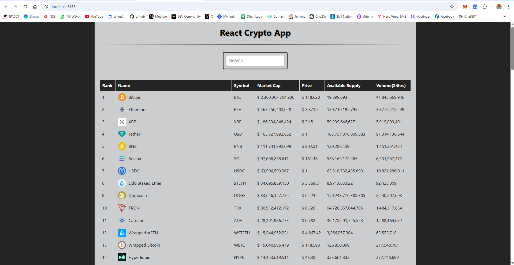
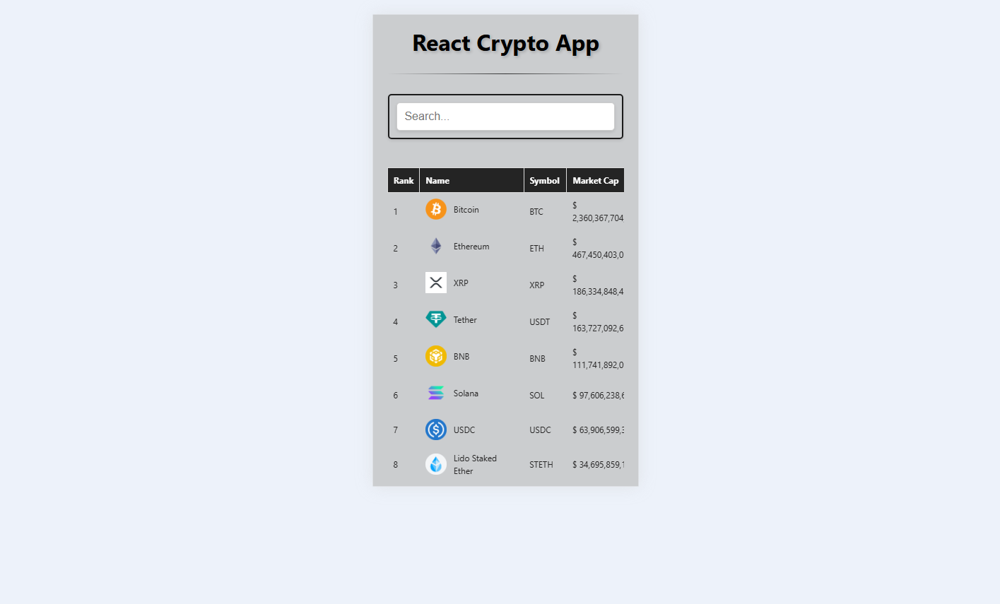

# ⚡ React Crypto Tracker App

A sleek and responsive cryptocurrency market viewer built with **React**. Displays real-time coin data with **debounced search**, **loading indicators**, and **modular component structure**.

## 🌐 Live Demo

> 🔗 Live App 👉 [https://your-vercel-url.vercel.app](https://your-vercel-url.vercel.app)

---

## 📸 Preview


> Desktop View


> Mobile View

---

## 🚀 Features

- 🔍 **Debounced Search** – filters only after the user stops typing
- 📈 **Live Market Data** – top 100 coins from CoinGecko
- ⏳ **Loader** – animated loader during data fetch
- 🎯 **Component-Based** – `SearchBox`, `CryptoLists`, `App`
- 📱 **Responsive Design** – mobile-friendly layout
- 🍞 **Error Toasts** – user-friendly error display

---

## 🧰 Tech Stack

- **React** (with Hooks)
- **Axios** – API handling
- **Lodash.debounce** – optimized search
- **React Toastify** – user notifications
- **React Loader Spinner** – loader
- **CoinGecko API** – cryptocurrency data

---

## 🛠️ Setup Installation

### 1. Clone the Repository

```bash
# Clone this repo
git clone https://github.com/surendergupta/react-crypto-app.git
cd react-crypto-app
```

### 2. Install dependencies
```bash
npm install
```

### 3. Run the app locally
```bash
npm run dev
```
Now open http://localhost:5173 in your browser.

---

## 🔗 API Reference
**CoinGecko API**
> [https://api.coingecko.com/api/v3/coins/markets](https://api.coingecko.com/api/v3/coins/markets)
Rate-limited. Use responsibly.

---

## 🧩 Folder Structure

```css
src/
├── Components/
│   ├── SearchBox/
│   │   ├── SearchBox.css
│   │   └── SearchBox.jsx
│   ├── CryptoLists/
│   │   ├── CryptoLists.css
│   │   └── CryptoLists.jsx
├── App.css
├── App.jsx
├── index.css
└── main.jsx

```

---

## 📄 License
This project is open-source and available under the MIT License.

===

## 🧑‍💻 Author
Made with ❤️ by [Surender Gupta](https://linkedin.com/in/surender-gupta)